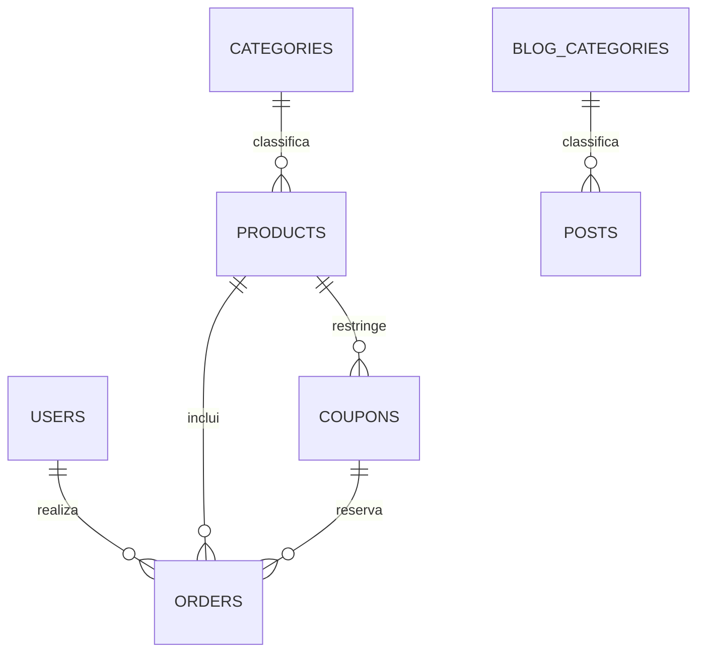

# Esquema relacional

Este documento descreve o estado produzido por todas as migrations. MySQL usa InnoDB e as chaves estrangeiras são declaradas pelas próprias migrations.

## Relacionamentos

## Tabelas de domínio

### `users`

`id`, `name`, `email` único, `email_verified_at`, `cpf`, `phone`, `password`, `role` (`admin` ou `customer`), `remember_token`, timestamps.

### `categories`

`id`, `name`, `slug` único, `description`, `icon`, `is_active`, timestamps.

### `products`

`id`, `category_id` anulável, `title`, `slug` único, `category`, `version`, `description`, `price decimal(10,2)`, `cover_path`, `file_path` anulável, `is_active`, `is_featured`, timestamps e soft delete.

- `category_id → categories.id`, com `NULL` ao excluir a categoria.
- Um produto só pode ser vendido quando está ativo e possui `file_path`.
- O arquivo apontado por `file_path` fica no disco privado `digital_products`.

### `orders`

`id`, `user_id`, `product_id`, `coupon_id` anulável, `gateway_reference`, `status` (`pending`, `paid`, `failed` ou `canceled`), `amount decimal(10,2)`, `payment_method`, `coupon_usage_counted_at`, `coupon_usage_released_at` e timestamps.

- `user_id → users.id`, com exclusão em cascata.
- `product_id → products.id`, com exclusão restrita.
- `coupon_id → coupons.id`, com `NULL` ao excluir o cupom.
- Os campos de contagem do cupom garantem liberação idempotente quando o gateway falha ou rejeita a cobrança.

### `coupons`

`id`, `code` único, `description`, `discount_type` (`percentage` ou `fixed`), `discount_value`, `min_order_amount`, `product_id`, `max_uses`, `times_used`, `starts_at`, `expires_at`, `is_active`, timestamps e soft delete.

`product_id → products.id`, com `NULL` ao excluir o produto. `max_uses = NULL` representa uso ilimitado.

### `blog_categories`

`id`, `name`, `slug` único, `description`, `icon`, `is_active`, timestamps.

### `posts`

`id`, `blog_category_id` anulável, `title`, `slug` único, `category`, `excerpt`, `content`, `cover_path`, `is_published`, `views_count`, `published_at`, timestamps.

`blog_category_id → blog_categories.id`, com `NULL` ao excluir a categoria. O campo `content` armazena somente HTML sanitizado.

### `newsletter_subscribers`

`id`, `email` único, `ip_address`, `user_agent`, `is_active`, `subscribed_at`, `unsubscribed_at`, timestamps e soft delete.

## Tabelas de infraestrutura Laravel

- `password_reset_tokens`
- `sessions`
- `cache` e `cache_locks`
- `jobs`, `job_batches` e `failed_jobs`

As migrations em `database/migrations` são a fonte executável deste esquema. Mudanças relacionais devem atualizar este documento no mesmo commit.
